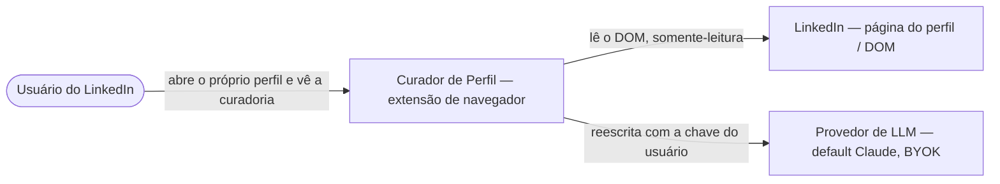
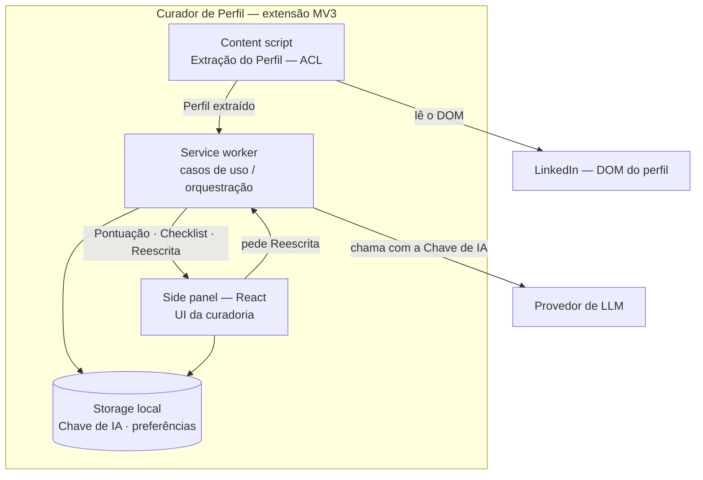
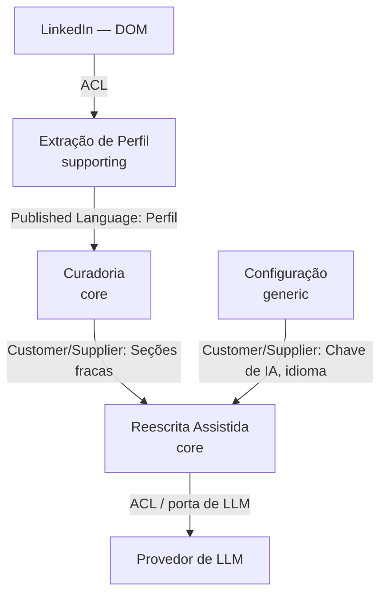
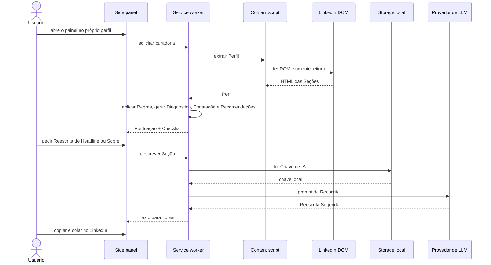

# Diagramas de arquitetura

> Alto nível (C4 L1–L2 + mapa de bounded contexts). Gerado/atualizado por `/diagramar` em 2026-06-20.
> Renderiza no GitHub e no Claude Code. Mantenha em sincronia com `context-map.md` e os `design.md`.
> Rótulos na linguagem ubíqua do `glossary.md`. Fontes: `vision.md`, `context-map.md`, `overview.md`.

## 1. Contexto do sistema (C4 L1)
> O sistema no centro, com a persona e os sistemas externos. Sem detalhe interno.

## 2. Containers (C4 L2)
> As peças que rodam dentro da extensão e como conversam. Sem backend — tudo no cliente.

## 3. Mapa de bounded contexts (DDD)
> Os contextos do sistema e o padrão de relação entre eles (ver `context-map.md`).

## 4. Fluxo-chave: diagnóstico + reescrita (jornadas 1 e 2)
> Caminho feliz ponta a ponta. O diagnóstico funciona sem IA; só a Reescrita chama o LLM.

